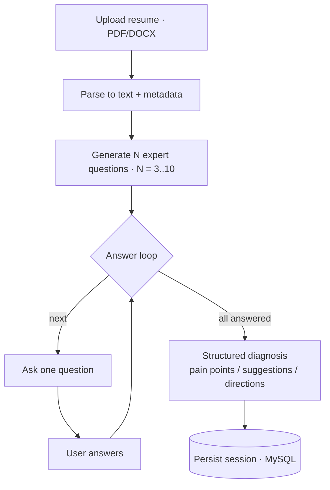

# AI Resume Analyzer — Parsing, Adaptive Interview & Diagnosis

A full-stack AI web app: upload a resume, answer a short set of AI-generated interview questions, and receive a structured diagnosis of weak points and concrete improvements.

**Live demo:** https://resume.bro9.vip

---

## Key Features

- **Resume parsing.** Extracts clean text and metadata from **PDF and DOCX**; parse errors are captured rather than crashing the flow.
- **Adaptive questioning.** Generates **3–10 expert follow-up questions** from the resume content; the user chooses how many.
- **Turn-by-turn interview.** Presents one question at a time, with each next question informed by previous answers.
- **Structured diagnosis.** After the final answer, produces pain points, optimization suggestions, and improvement directions as structured output.
- **Strict, validated LLM output.** Model responses must be valid JSON; they are validated with **Pydantic v2** and retried automatically on schema failure.
- **Session persistence.** Questions, answers, and the final report are stored in MySQL and retrievable via the API.

## Tech Stack

| Layer | Technology |
|-------|-----------|
| Orchestration / LLM | LangGraph + LangChain, DeepSeek (OpenAI-compatible) |
| Backend | FastAPI, SQLAlchemy 2 (async) + aiomysql, Alembic, Pydantic v2 |
| Parsing | pypdf, python-docx |
| Frontend | Next.js 16 (App Router), React 19, TypeScript, TailwindCSS 4, shadcn/ui |

## How It Works



The LangGraph flow is also exported to [`backend/app/llm/langgraph_flow.png`](backend/app/llm/langgraph_flow.png).

## API

| Method | Endpoint | Purpose |
|--------|----------|---------|
| POST | `/api/v1/resumes` | Upload a resume |
| POST | `/api/v1/sessions` | Create a session, return question #1 |
| POST | `/api/v1/sessions/{id}/answers` | Submit an answer, get next question or final analysis |
| GET | `/api/v1/sessions/{id}` | Session detail |
| GET | `/api/v1/sessions?limit=20&offset=0` | Session history |

## Getting Started

**Backend** (Python 3.12, MySQL 8.x)

```bash
cd backend
python -m venv .venv && source .venv/bin/activate   # Windows: .venv\Scripts\activate
pip install -r requirements.txt
cp .env.example .env          # set DATABASE_URL, DEEPSEEK_API_KEY, ...
alembic upgrade head
uvicorn app.main:app --reload --host 0.0.0.0 --port 8000
```

**Frontend** (Next.js)

```bash
cd frontend
npm install
cp .env.example .env.local    # set NEXT_PUBLIC_API_BASE_URL
npm run dev                    # http://localhost:3000
```

## Project Structure

```
backend/
  app/
    api/v1/      # routes + Pydantic schemas
    core/        # config, errors, middleware
    db/          # async engine, models, session
    llm/         # client, LangGraph orchestrator, prompts, JSON utils
    services/    # resume & session business logic
    utils/       # resume parsing
  alembic/       # migrations
frontend/
  src/app/       # Next.js App Router
```
